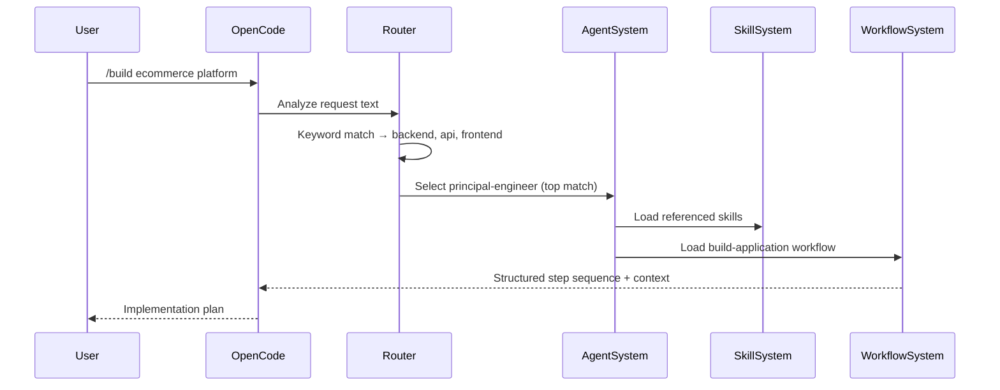

# Design Document: GOD-OPENCODE

## Overview

GOD-OPENCODE is an AI engineering operating system layered on top of OpenCode. It wraps OpenCode's underlying AI coding assistant with a modular, self-contained framework — organized into 10 functional layers — that gives any developer a single-command setup for a production-grade AI engineering environment.

The core insight is that OpenCode's value compounds when it has rich, task-specific context: the right Skills (domain knowledge), the right Agent persona (role framing), and the right Workflow (step sequence). GOD-OPENCODE provides all three, plus the infrastructure to manage, install, update, and verify them.

The system is entirely file-based and declarative: Skills are Markdown files, Agents are Markdown files, Workflows are Markdown files, and the Router is a JSON configuration file. PowerShell scripts drive installation and orchestration. This means the framework works on any Windows machine with PowerShell, requires no runtime daemon, and is trivially version-controlled and extended.

### Key Design Decisions

- **File-system as the data layer.** All framework artifacts (Skills, Agents, Workflows, Prompts, Templates, Memory) live as Markdown/JSON files. This keeps the framework transparent, diff-able, and portable.
- **PowerShell as the orchestration layer.** The installer and all maintenance scripts are PowerShell, matching the Windows-first audience of the project and requiring no external runtime dependencies.
- **OpenCode as the execution host.** GOD-OPENCODE does not replace OpenCode; it enriches it by writing files to the directories OpenCode reads (e.g., `~/.config/opencode/skills/`).
- **Router-driven dispatch.** Rather than requiring users to know which Agent or Skill to invoke, the Router keyword-matches user requests and auto-selects the right context — making the system usable from the first command.
- **Idempotent installation.** Every install step uses `Write-IfChanged` semantics: it only writes files when content has changed, so re-running the installer is always safe.


---

## Architecture

GOD-OPENCODE is organized as a layered stack. Each layer has a single responsibility and depends only on the layers below it.

```
┌─────────────────────────────────────────────────────────────────┐
│  Layer 10: Intelligence Engine                                   │
│  (Repository scanning, project type detection, plan generation) │
├─────────────────────────────────────────────────────────────────┤
│  Layer 9:  Router                                                │
│  (Keyword-to-Agent mapping, Skill selection, fallback logic)    │
├─────────────────────────────────────────────────────────────────┤
│  Layer 8:  Command System                                        │
│  (Slash commands: /build /architect /debug /review /secure …)   │
├──────────────────────────┬──────────────────────────────────────┤
│  Layer 5: MCP Management │  Layer 6: Prompt Library             │
│  (registry.json,         │  (prompts/{category}/*.md)           │
│   mcp-config.json,       │                                       │
│   install-mcps.ps1)      │                                       │
├──────────────────────────┴──────────────────────────────────────┤
│  Layer 4: Workflow System                                        │
│  (workflows/*.md, parameterized step sequences)                 │
├───────────────────────────────────┬─────────────────────────────┤
│  Layer 3: Agent System            │  Layer 7: Template System   │
│  (agents/{name}/AGENT.md)         │  (templates/{name}/)        │
├───────────────────────────────────┴─────────────────────────────┤
│  Layer 2: Skills System                                          │
│  (skills/{category}/{name}/SKILL.md → ~/.config/opencode/…)     │
├─────────────────────────────────────────────────────────────────┤
│  Layer 8b: Memory System                                         │
│  (memory/*.md — artifact store for decisions, TODOs, ADRs)      │
├─────────────────────────────────────────────────────────────────┤
│  Layer 1: Core Installer Engine                                  │
│  (god-install.ps1 → god-builder → god-expansion →               │
│   god-intelligence → upgrade-all-skills → install-mcps)         │
└─────────────────────────────────────────────────────────────────┘
                         ↕ reads/writes
┌─────────────────────────────────────────────────────────────────┐
│  OpenCode (external host)                                        │
│  Reads ~/.config/opencode/skills/ at runtime                    │
└─────────────────────────────────────────────────────────────────┘
```

### Layer Interaction Model

The installer (Layer 1) is the only component that performs writes to external paths (OpenCode's skills directory). All other layers operate within the repository's own directory tree. At runtime, OpenCode reads the installed skills; the Router, Commands, and Intelligence Engine all work through file-system reads and OpenCode's prompt context.




---

## Components and Interfaces

### 1. Core Installer Engine (`god-install.ps1`)

The top-level orchestrator. Responsibilities:

- Validates and creates the required directory tree (15 directories)
- Calls each sub-engine script in sequence: `god-builder.ps1` → `god-expansion.ps1` → `god-intelligence.ps1` → `upgrade-all-skills.ps1`
- Calls `install.ps1` to copy skills to the OpenCode directory
- Calls `install-mcps.ps1` to process the MCP registry
- Wraps each step in a try/catch; on failure: logs the error, continues to the next step
- Emits a summary table with component counts at the end

**Script interface:**
```powershell
# Invocation
.\god-install.ps1

# Internal step runner
function RunStep { param([string]$Title, [string]$Script) }

# Directory bootstrapper
function EnsureFolder { param([string]$Folder) }

# Idempotent file writer
function Write-IfChanged { param([string]$Path, [string]$Content) }
```

**Required directories created by installer:**
`agents`, `backups`, `commands`, `config`, `logs`, `mcps`, `memory`, `models`, `prompts`, `router`, `scripts`, `skills`, `templates`, `tools`, `workflows`

---

### 2. Skills System (`skills/`, `install.ps1`, `upgrade-all-skills.ps1`)

Manages the library of domain-specific knowledge documents.

**Directory contract:**
```
skills/
  {category}/          ← e.g., ai, backend, frontend, devops, security, database, advanced, testing
    {skill-name}/
      SKILL.md          ← required
```

**SKILL.md required sections:**
```markdown
---
name: {skill-name}
description: {one-line description}
---
# {skill-name}
## Mission
## Core Responsibilities
## Workflow
## Quality Standards
```

**Install interface** (`install.ps1`):
- Enumerate all directories under `skills/` that contain `SKILL.md`
- Copy each to `~/.config/opencode/skills/{skill-name}/` (overwrite always)
- Report count of installed skills

**Upgrade interface** (`upgrade-all-skills.ps1`):
- Same as install but re-generates the SKILL.md content to the latest template
- Used for bulk regeneration without a full re-install

---

### 3. Agent System (`agents/`, `god-builder.ps1`)

Defines virtual engineering personas that coordinate skills.

**Directory contract:**
```
agents/
  {agent-name}/
    AGENT.md            ← required
```

**AGENT.md required sections:**
```markdown
# {agent-name}
## Role
## Responsibilities
## Standards
## Skills          ← list of skill names this agent activates
## Delegation      ← optional: other agents this agent may delegate to
```

**Supported agents (minimum set):**
`principal-engineer`, `backend-engineer`, `frontend-engineer`, `ai-engineer`, `security-engineer`, `database-architect`, `devops-engineer`, `debugger`, `researcher`, `technical-writer`

**Agent composition:** An `AGENT.md` may include a `## Delegation` section listing other agent names. When the system processes a delegating agent, it loads the referenced agent's skill context in addition to its own.

---

### 4. Workflow System (`workflows/`)

Provides ordered, reusable step sequences for complex tasks.

**Directory contract:**
```
workflows/
  {workflow-name}.md    ← one file per workflow
```

**Workflow file structure:**
```markdown
# {workflow-name}
## Purpose
## Parameters
  - `{PARAM_NAME}`: description
## Steps
  ### Step 1: {Title}
  - Agent: {agent-name}
  - Skills: [{skill-name}, ...]
  - Action: {description}
  ### Step 2: ...
```

**Required built-in workflows:**
- `build-application.md` — Full-Stack Application Build
- `api-development.md`
- `security-audit.md`
- `bug-investigation.md`

**Parameterization:** Placeholders in the form `{{PARAM_NAME}}` are substituted at invocation time. The calling command passes a parameter map.


---

### 5. MCP Management System (`mcps/`, `install-mcps.ps1`)

Tracks and validates MCP server availability.

**File contracts:**

`mcps/registry.json`:
```json
{
  "servers": {
    "{mcp-name}": {
      "enabled": true | false,
      "description": "...",
      "install_command": "..."
    }
  }
}
```

`mcps/mcp-config.json`:
```json
{
  "mcpServers": {
    "{mcp-name}": {
      "enabled": true | false,
      "config": { ... }
    }
  }
}
```

**Required MCPs:** `filesystem`, `github`, `playwright`, `context7`, `tavily`

**Install flow** (`install-mcps.ps1`):
1. Read and parse `registry.json`
2. For each server where `enabled == true`: attempt installation, log success/failure
3. Skip servers where `enabled == false`
4. Continue on individual failure (do not abort)

---

### 6. Prompt Library (`prompts/`)

Central store of reusable prompt templates.

**Directory contract:**
```
prompts/
  {category}/           ← e.g., coding, ai, research, writing, business
    {prompt-name}.md
```

**Prompt file structure:**
```markdown
# {Prompt Name}
## Purpose
{description of when to use this prompt}
## Parameters
| Parameter | Description | Required |
|-----------|-------------|----------|
| {NAME}    | ...         | yes/no   |
## Prompt
{prompt body with {{PARAM_NAME}} placeholders}
## Example Usage
```

**Required categories:** `coding` (Architecture Review, Bug Hunt, API Design, Code Review, Refactoring), `ai`, `research`, `writing`, `business`, `security` (Security Review)

---

### 7. Template System (`templates/`)

Scaffold generators for common project types.

**Directory contract:**
```
templates/
  {template-name}/
    README.md           ← required, describes setup/run steps
    {scaffold files}    ← all files needed to run locally
```

**Required templates:** `fastapi-api`, `react-app`, `nextjs-saas`, `discord-bot`, `mcp-server`, `rag-project`

**Generation contract:** Using a template copies the template directory to a target path, substituting any `{{PROJECT_NAME}}` placeholders.

---

### 8. Memory System (`memory/`)

Project-scoped artifact store for persistent context.

**Directory contract:**
```
memory/
  {type}-{slug}.md      ← e.g., adr-use-postgres.md, todo-add-auth.md
```

**Memory artifact file structure:**
```markdown
---
type: architecture-decision | coding-convention | todo | changelog | assumption
title: {title}
timestamp: {ISO-8601}
author: {identifier}
---
# {title}
{content}
```

**Supported types:** `architecture-decision`, `coding-convention`, `todo`, `changelog`, `assumption`

**List command interface:** A `memory-list` command reads all `memory/*.md` files and outputs a table of `type`, `title`, `timestamp`.

---

### 9. Router (`router/agent-router.json`, routing logic)

Maps user request text to Agent + Skills selection.

**Configuration contract** (`router/agent-router.json`):
```json
{
  "routing": {
    "{keyword}": "{agent-name}",
    ...
  }
}
```

**Routing algorithm:**
1. Tokenize the user request into lowercase words
2. For each word, check if it exists as a key in the `routing` map
3. Count matches per agent; sort agents by match count descending
4. Return the agent with the highest count as the selected agent
5. Return the top 3 agents as the candidate list
6. If no matches: return `principal-engineer` with a notice
7. After agent selection: read the agent's `AGENT.md`, extract referenced skills, add to execution context

**Extensibility:** New keyword-to-agent mappings are added by editing `agent-router.json` only.

---

### 10. Command System (`commands/`)

Slash command definitions that trigger coordinated actions.

**Directory contract:**
```
commands/
  {command-name}.md     ← one file per command
```

**Command file structure:**
```markdown
# /{command-name}
## Purpose
## Steps
  1. {Step description (with Agent: and Skills: annotations)}
  ...
## Output
{description of what this command produces}
```

**Required commands:** `build`, `architect`, `debug`, `review`, `secure`, `optimize`

**`/build` pipeline (detailed):**
1. Parse the project description from the user request
2. Call the Router to select Agent and Skills
3. Call the Intelligence Engine to identify project type
4. Select the matching Workflow for the project type
5. Execute the Workflow steps, passing agent/skill context to each step
6. Produce a structured Implementation Plan (project type, workflow, agents, skills, prioritized improvements)

**Extensibility:** New commands are added by creating a new `.md` file in `commands/` — no script changes required.

---

### 11. Intelligence Engine (`scripts/god-intelligence.ps1`, `tools/project-scan.ps1`)

Scans repositories and produces implementation plans.

**Scan inputs:** A target directory path.

**Detection logic:**
- Language detection: count files by extension (`.py`, `.ts`, `.js`, `.go`, `.rs`, etc.)
- Project type detection: presence of config files (`package.json` → Node, `pyproject.toml` → Python, `Dockerfile` → containerized, `openapi.yaml` → API, etc.)

**Output — Implementation Plan document (Markdown):**
```markdown
# Implementation Plan — {project-name}
## Detected Project Type
## Primary Languages
## Recommended Workflow
## Assigned Agents
## Applied Skills
## Prioritized Improvements
  1. {improvement} — rationale
  ...
```

**Memory storage:** After producing the plan, the engine writes a `memory/adr-{slug}.md` file with `type: architecture-decision`, the current timestamp, and the plan content.

---

### 12. Health Check (`god-health.ps1`)

Verifies framework installation state.

**Check sequence:**
1. Required directories exist (repository root)
2. All skills present in `~/.config/opencode/skills/`
3. All enabled MCPs reachable (ping/validation)
4. `router/agent-router.json` is valid JSON with ≥1 routing rule
5. `mcps/registry.json` is valid JSON
6. Key scripts exist (`god-install.ps1`, `install-mcps.ps1`, etc.)

**Output format — failure:**
```
[FAIL] {component}: expected {expected_state}, found {actual_state}
```

**Output format — success:**
```
[OK]   {component}
...
All checks passed. {N} components verified.
```


---

## Data Models

### Skill

```typescript
interface Skill {
  name: string;            // kebab-case, matches directory name
  description: string;     // one-line summary
  category: string;        // e.g., "ai", "backend", "frontend"
  path: string;            // relative path: skills/{category}/{name}/SKILL.md
  sections: {
    mission: string;
    responsibilities: string[];
    workflow: string[];
    qualityStandards: {
      always: string[];
      never: string[];
    };
  };
}
```

### Agent

```typescript
interface Agent {
  name: string;            // kebab-case, matches directory name
  role: string;
  responsibilities: string[];
  standards: string[];
  skills: string[];        // list of skill names this agent activates
  delegation?: string[];   // optional list of agent names to delegate sub-tasks to
  path: string;            // agents/{name}/AGENT.md
}
```

### Workflow

```typescript
interface WorkflowStep {
  title: string;
  agent: string;           // agent name
  skills: string[];
  action: string;
}

interface Workflow {
  name: string;            // kebab-case, matches filename
  purpose: string;
  parameters: Record<string, string>; // param name → description
  steps: WorkflowStep[];
  path: string;            // workflows/{name}.md
}
```

### Router Configuration

```typescript
interface RouterConfig {
  routing: Record<string, string>; // keyword → agent name
}

interface RoutingResult {
  selectedAgent: string;
  confidence: number;      // match count for selected agent
  candidates: Array<{
    agent: string;
    score: number;
  }>;                      // top 3 matches
  skills: string[];        // skills from selected agent's AGENT.md
  fallback: boolean;       // true if defaulted to principal-engineer
}
```

### Memory Artifact

```typescript
interface MemoryArtifact {
  type: 'architecture-decision' | 'coding-convention' | 'todo' | 'changelog' | 'assumption';
  title: string;
  timestamp: string;       // ISO-8601
  author: string;
  content: string;
  path: string;            // memory/{type}-{slug}.md
}
```

### MCP Registry Entry

```typescript
interface MCPEntry {
  name: string;
  enabled: boolean;
  description?: string;
  install_command?: string;
  config?: Record<string, unknown>;
}

interface MCPRegistry {
  servers: Record<string, MCPEntry>;
}
```

### Intelligence Scan Result

```typescript
interface ScanResult {
  projectName: string;
  projectType: 'api' | 'frontend-app' | 'fullstack' | 'cli-tool' | 'library' | 'unknown';
  primaryLanguages: string[];
  recommendedWorkflow: string;
  assignedAgents: string[];
  appliedSkills: string[];
  improvements: Array<{
    priority: number;
    description: string;
    rationale: string;
  }>;
  timestamp: string;       // ISO-8601
}
```

### Installation Summary

```typescript
interface InstallSummary {
  skills: number;
  agents: number;
  workflows: number;
  templates: number;
  prompts: number;
  mcpRegistryStatus: 'Present' | 'Missing';
  failedSteps: string[];
  timestamp: string;
}
```


---

## Correctness Properties

*A property is a characteristic or behavior that should hold true across all valid executions of a system — essentially, a formal statement about what the system should do. Properties serve as the bridge between human-readable specifications and machine-verifiable correctness guarantees.*

### Property Reflection

Before listing properties, redundancies were eliminated:

- Requirements 1.3 and 2.4 both describe "skills in repo → skills in target directory after install." These are merged into **Property 1**.
- Requirements 2.5 and 1.7 both test idempotent install. The broader idempotence (1.7, custom content safety) subsumes the narrower overwrite case. Merged into **Property 2**.
- Requirements 9.1 and 9.2 both describe the router's keyword→agent mapping. 9.2 is the complete behavior; 9.1 is implied. Merged into **Property 3**.
- Requirements 12.5 and 12.6 are complementary failure/success reporting. Each provides unique value — kept as separate properties.
- Requirements 1.6 and 5.3 both describe "fail one step, continue remaining." 5.3 is the MCP-specific instance. Combined into **Property 8** (error isolation).

---

### Property 1: Skill Installation Round Trip

*For any* skill directory present in `skills/{category}/{name}/` with a `SKILL.md` file, after the installer runs, the skill directory and its `SKILL.md` SHALL be present at `~/.config/opencode/skills/{name}/`.

**Validates: Requirements 1.3, 2.4**

---

### Property 2: Idempotent Installation

*For any* file in the repository that is not managed by the installer (i.e., created by the user and not listed in the installer's generated-file manifest), running the installer a second time SHALL leave that file unchanged and present.

**Validates: Requirements 1.7, 2.5**

---

### Property 3: Router Keyword-to-Agent Mapping

*For any* request text containing at least one keyword defined in `agent-router.json`, the router SHALL return an agent name that matches the agent mapped to the highest-frequency matched keyword, and the result SHALL include the top 3 candidate agents ordered by match score.

**Validates: Requirements 9.1, 9.2, 9.3**

---

### Property 4: Router Default Fallback

*For any* request text containing no keywords present in `agent-router.json`, the router SHALL return `principal-engineer` as the selected agent and set `fallback: true` in the result.

**Validates: Requirement 9.4**

---

### Property 5: Router Skill Completeness

*For any* agent selected by the router, the returned execution context SHALL include all skill names referenced in that agent's `AGENT.md` Skills section.

**Validates: Requirement 9.6**

---

### Property 6: SKILL.md Schema Completeness

*For any* `SKILL.md` file in the `skills/` directory tree, the file SHALL contain all required sections: `name` (front-matter), `description` (front-matter), `Mission`, `Core Responsibilities`, `Workflow`, and `Quality Standards`.

**Validates: Requirement 2.2**

---

### Property 7: AGENT.md Schema Completeness

*For any* `AGENT.md` file in the `agents/` directory tree, the file SHALL contain all required sections: `Role`, `Responsibilities`, `Standards`, and `Skills`.

**Validates: Requirement 3.3**

---

### Property 8: Error Isolation (Installer and MCP Manager)

*For any* sequence of N installation steps where step K fails, the system SHALL log exactly one error message for step K containing the step name and failure reason, and SHALL execute all remaining steps K+1 through N.

**Validates: Requirements 1.6, 5.3**

---

### Property 9: Installer Summary Accuracy

*For any* installation run that completes, the summary report SHALL report a skills count equal to the number of skill directories copied to `~/.config/opencode/skills/`, an agents count equal to the number of agent directories in `agents/`, and a workflows count equal to the number of `.md` files in `workflows/`.

**Validates: Requirement 1.5**

---

### Property 10: Skill Directory Structure Invariant

*For any* skill present in the repository, its path SHALL match the pattern `skills/{category}/{skill-name}/SKILL.md` where `{category}` and `{skill-name}` consist only of lowercase letters and hyphens.

**Validates: Requirements 2.1, 13.4**

---

### Property 11: Memory Artifact Timestamp and Author Invariant

*For any* memory artifact created or updated by the system, the artifact file SHALL contain a non-empty `timestamp` field in ISO-8601 format and a non-empty `author` field in its front-matter.

**Validates: Requirement 8.3**

---

### Property 12: Memory List Completeness

*For any* set of memory artifact files present in `memory/`, the list command SHALL return one entry per file, each entry containing the artifact's `type`, `title`, and `timestamp`.

**Validates: Requirement 8.5**

---

### Property 13: Intelligence Engine Plan Completeness

*For any* completed repository scan, the produced Implementation Plan document SHALL contain all six required sections: Detected Project Type, Primary Languages, Recommended Workflow, Assigned Agents, Applied Skills, and Prioritized Improvements.

**Validates: Requirement 11.5**

---

### Property 14: Intelligence Engine Memory Storage

*For any* completed repository scan, the engine SHALL write exactly one `memory/adr-{slug}.md` file with `type: architecture-decision` and a `timestamp` field matching the scan completion time.

**Validates: Requirement 11.6**

---

### Property 15: Health Check Failure Message Completeness

*For any* health check step that fails, the output SHALL include the component name, the expected state, and the actual observed state in a single clearly labelled line.

**Validates: Requirement 12.5**

---

### Property 16: Health Check Success Count

*For any* health check run where all verification steps pass, the final output line SHALL include a count equal to the number of verification steps that were executed.

**Validates: Requirement 12.6**

---

### Property 17: Prompt File Parameters Section

*For any* prompt template file in `prompts/`, the file SHALL contain a section labelled `Parameters` (or `## Parameters`) listing all substitutable placeholders used in the prompt body.

**Validates: Requirement 6.3**

---

### Property 18: Template Generation Includes README

*For any* project generated from any template in `templates/`, the generated project directory SHALL contain a `README.md` file.

**Validates: Requirement 7.4**

---

### Property 19: Workflow Step Ordering

*For any* workflow definition file in `workflows/`, the steps presented during execution SHALL appear in the same sequential order as they are defined in the source Markdown file.

**Validates: Requirement 4.2**

---

### Property 20: Workflow Parameterization Substitution

*For any* workflow template containing `{{PARAM_NAME}}` placeholders and any valid parameter map where all referenced parameter names are present, the output of parameter substitution SHALL contain no unresolved `{{...}}` placeholders.

**Validates: Requirement 4.5**

---

### Property 21: README Section Completeness

*For any* version of the root `README.md`, the file SHALL contain all five required sections: project purpose, architecture overview, installation instructions, quick-start example, and contribution guidelines.

**Validates: Requirement 13.1**


---

## Error Handling

### Installer Error Strategy

The installer uses a `try/catch` pattern around each sub-step invocation via `RunStep`. The strategy is **log-and-continue**: no individual failure aborts the entire installation. This is intentional — a missing expansion engine should not prevent skills from being installed.

```
For each step:
  try:
    invoke step script
    log [SUCCESS] {step-name}
  catch:
    log [FAILED] {step-name}: {error message}
    continue to next step
```

Failed steps are tracked in the `InstallSummary.failedSteps` array and surfaced in the summary report.

### MCP Manager Error Strategy

Same log-and-continue strategy. The MCP Manager iterates the registry and processes each enabled MCP independently. A failed MCP installation (e.g., network error, missing tool) is logged with the MCP name and reason, and the loop continues to the next entry.

### Health Check Error Strategy

The Health Check does NOT continue silently on failure. Each failed check is reported immediately with component, expected, and actual state. The exit code reflects whether all checks passed (0) or any failed (1), enabling CI integration.

### Skill Overwrite Safety

The `Write-IfChanged` function checks current content before writing. This prevents unnecessary disk writes and avoids clobbering files that are already up to date. Custom files (not in the generated manifest) are never touched by the installer.

### Memory Artifact Conflicts

If a memory artifact file already exists at a target path, the Memory System appends a versioned entry rather than overwriting (via `>>` append to a running `changelog`-style file, or by using a unique slug derived from timestamp). This prevents data loss on re-scan.

### Router Fallback

When the router finds no keyword matches, it logs a notice: `[INFO] No routing match found for request. Defaulting to principal-engineer.` This is surfaced to the user so they can manually specify an agent if the default is inappropriate.

### Intelligence Engine — Unknown Project Type

If the Intelligence Engine cannot determine a project type from the file structure, it sets `projectType: "unknown"` and recommends the `build-application` workflow as a safe default, noting in the plan that manual review is recommended.


---

## Testing Strategy

### PBT Applicability Assessment

GOD-OPENCODE is primarily a **file-based framework with configuration-driven orchestration**. The core logic includes:

- File structure validation (structural invariants)
- Content schema validation (SKILL.md, AGENT.md, prompt files)
- Routing logic (pure function: text → agent + skills)
- Installer idempotence (state transformation: directory state → directory state)
- Workflow step ordering (sequence invariants)
- Memory artifact management (CRUD with invariants)
- Intelligence Engine output completeness (report generation)

Most of these involve **pure functions or predictable transformations over structured inputs**, making property-based testing well-suited for a significant portion of the test surface.

PBT is NOT appropriate for:
- MCP connectivity checks (external service behavior)
- Agent-to-memory context injection (integration wiring)
- OpenCode host interaction (external runtime)

---

### Property-Based Testing

**Library:** [Pester](https://pester.dev/) for PowerShell test execution, with [PSScriptAnalyzer](https://github.com/PowerShell/PSScriptAnalyzer) for static checks. For pure routing logic extracted to a testable function, use Pester's `foreach` parameterized test blocks to run 100+ iterations.

For routing and schema validation (which are effectively pure functions), tests are written in Pester using generated inputs:

```powershell
# Property 3: Router Keyword-to-Agent Mapping
# Feature: god-opencode, Property 3: Router keyword-to-agent mapping
Describe "Router keyword mapping" {
    $keywords = (Get-Content "$Root\router\agent-router.json" | ConvertFrom-Json).routing
    foreach ($keyword in $keywords.PSObject.Properties.Name) {
        It "maps keyword '$keyword' to correct agent" {
            $result = Invoke-Router -Request "I need help with $keyword tasks"
            $result.SelectedAgent | Should -Be $keywords.$keyword
        }
    }
}
```

**Minimum 100 iterations** for randomized property tests (router with generated request strings, schema validation across all discovered files).

Each property-based test MUST include a comment referencing the design property:
```powershell
# Feature: god-opencode, Property {N}: {property_text}
```

---

### Unit Tests

Unit tests cover specific examples, edge cases, and error conditions not handled by property tests:

- **Router fallback:** Request with zero matching keywords → `principal-engineer` (Property 4)
- **Installer step ordering:** Mock each sub-script, verify invocation sequence matches defined order (Requirement 1.2)
- **MCP error isolation:** Mock one MCP installation to fail, verify remaining MCPs are processed (Property 8)
- **`Write-IfChanged` semantics:** File with same content → no write; file with changed content → write; missing file → create
- **Workflow parameterization:** Template with 3 params, valid param map → no unresolved placeholders (Property 20)

Unit tests should be concise. Property tests handle broad coverage; unit tests should focus on specific behaviors and error conditions.

---

### Integration Tests

Integration tests verify component wiring and interactions with the file system and external services:

- **Full install run:** Run `god-install.ps1` against a temp directory, verify all required directories and files are created, verify summary counts match actual file counts
- **Skill copy end-to-end:** Verify skills appear in `~/.config/opencode/skills/` after install
- **Health check against live state:** Run `god-health.ps1` after a clean install, verify all checks pass
- **MCP reachability:** Verify each enabled MCP responds (requires network, mark as `[Integration]` for CI gating)
- **Intelligence Engine scan:** Run against the GOD-OPENCODE repository itself, verify the output plan contains all required sections

Integration tests that require external network access should be tagged `[Integration]` and excluded from the default test run.

---

### Smoke Tests

Quick structural checks for repository readiness:

| Check | Pass Condition |
|---|---|
| `god-health.ps1` exists | File present at root |
| `CONTRIBUTING.md` exists | File present at root |
| `CHANGELOG.md` exists | File present at root |
| `LICENSE` exists | File present at root |
| `upgrade-all-skills.ps1` exists | File at `scripts/upgrade-all-skills.ps1` |
| `mcp-config.json` exists | File at `mcps/mcp-config.json` |
| `registry.json` exists | File at `mcps/registry.json` |
| `agent-router.json` valid JSON | Parses without error |

Smoke tests run in under 5 seconds and require no external dependencies. They form the first stage of CI.

---

### Test Organization

```
tests/
  smoke/
    Test-RepositoryStructure.Tests.ps1
  unit/
    Test-Router.Tests.ps1
    Test-Installer.Tests.ps1
    Test-SkillSchema.Tests.ps1
    Test-AgentSchema.Tests.ps1
    Test-MemoryArtifacts.Tests.ps1
    Test-WorkflowOrdering.Tests.ps1
  property/
    Test-RouterProperties.Tests.ps1
    Test-SkillInstallation.Tests.ps1
    Test-HealthCheck.Tests.ps1
    Test-IntelligenceEngine.Tests.ps1
  integration/
    Test-FullInstall.Tests.ps1
    Test-MCPConnectivity.Tests.ps1
```

**Run command (single pass, no watch mode):**
```powershell
Invoke-Pester -Path .\tests\ -Output Detailed
# Integration tests only:
Invoke-Pester -Path .\tests\integration\ -Tag Integration -Output Detailed
```

