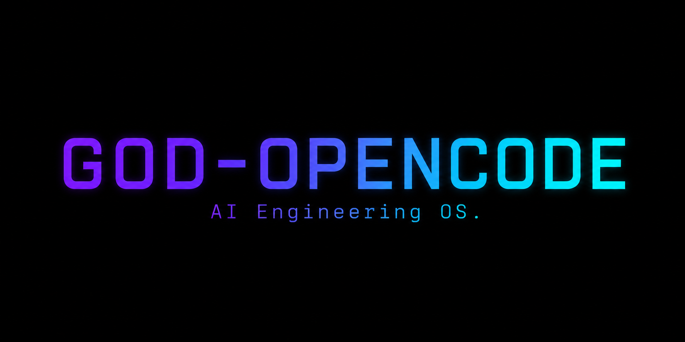
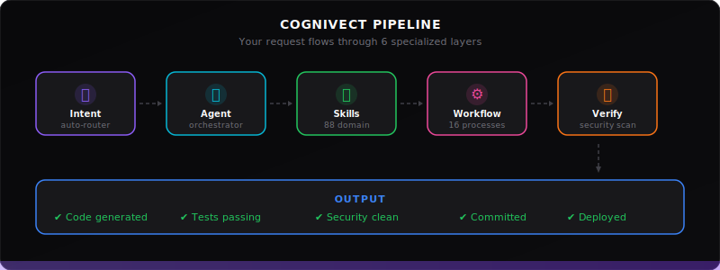

<p align="center">
  
</p>

<h3 align="center">GOD-OPENCODE — the AI engineering OS that thinks in vectors.</h3>

<p align="center">
  Built by <strong>CogniVect</strong> — 10 specialist agents, 88 domain skills, 16 automated workflows.
</p>

<p align="center">
  <a href="https://github.com/mattycigemp-crypto/GOD-OPENCODE/actions/workflows/publish-skills.yml"></a>
  <a href="https://github.com/mattycigemp-crypto/GOD-OPENCODE/releases/tag/v1.7.0"></a>
  <a href="https://github.com/mattycigemp-crypto/GOD-OPENCODE"></a>
  <a href="https://cognivect.com"></a>
</p>

---

## What is GOD-OPENCODE?

GOD-OPENCODE wraps OpenCode with a three-layer architecture that gives every request the right context:

- **10 Specialist Agents** — senior principal engineers, security auditors, database architects, and more
- **88 Domain Skills** — production-grade knowledge for fastapi, react, postgres, kubernetes, and 84 other domains
- **16 Automated Workflows** — step-by-step processes for API development, security audits, debugging, and deployment
- **Universal Skill Distribution** — convert and sync skills to 16+ AI tools (Cursor, Claude, Cline, Windsurf, Copilot, and more)

Instead of getting a generic AI assistant, you get the right expert for the job. Skills work everywhere — not just OpenCode.

---

## Animated Demo

<p align="center">
  
</p>

<p align="center">
  
</p>

---

## Quick Start

```powershell
# Clone and enter the directory
git clone https://github.com/mattycigemp-crypto/GOD-OPENCODE
cd GOD-OPENCODE

# Launch the terminal UI (main command)
.\god-ui.ps1
```

Press Enter to install globally — installs skills/agents/workflows into `~/.config/opencode/`.

---

## What's New in v1.7.0

| Feature | Command | Purpose |
|---------|---------|--------|
| Skill Security Auditor | `.\scripts\audit-skills.ps1` | Scan SKILL.md for malicious patterns |
| Cross-Tool Converter | `.\scripts\convert-skills.ps1` | Convert SKILL.md → .cursorrules, CLAUDE.md, .clinerules, .windsurfrules, copilot-instructions.md |
| Skill Sync (16 tools) | `.\scripts\sync-skills.ps1` | Symlink skills into Claude, Cursor, Windsurf, Cline, Copilot, and 11 more |
| Universal Publisher | `.\scripts\publish-skills.ps1` | One-command pipeline: audit → convert → sync → package |
| Competitive Landscape | `docs/competitive-landscape.md` | Full ecosystem analysis vs. claude-skills, CrewAI, Mastra, LangGraph |

---

## What Was New in v1.6.0

| Feature | Command | Purpose |
|---------|---------|--------|
| Security Scanner | `T` in TUI / `.\god-cli.ps1 security-scan` | Pre-commit secret/vulnerability scan |
| Agent Orchestrator | `A` in TUI / `.\god-cli.ps1 agent-orch` | Multi-agent task delegation |
| MCP Connectors | `M` in TUI / `.\god-cli.ps1 mcp-connect` | Chrome/DB/Jira/Monitoring integration |
| Smart Git | `G` in TUI / `.\god-cli.ps1 smart-git` | Atomic commits, save points, rollback |
| Test-Driven AI | `workflows/test-driven-ai.md` | Generate tests before code |

---

## What You Get

| Component | Count | Purpose |
|-----------|-------|--------|
| Agents | 10 | Specialized AI personas |
| Skills | 88 | Domain knowledge loaded on-demand |
| Workflows | 16 | Step-by-step processes |
| Commands | 6 | Slash commands for common tasks |
| CLI | 1 | Non-interactive command-line interface |

---

## TUI Menu

| Key | Action |
|-----|--------|
| Enter / 1 | Install Globally (default) |
| 2 | Health Check |
| 3 | Code Graph |
| 4 | Skill Fragment |
| 5 | Memory |
| 6 | Cross-Platform |
| 7 | Tests |
| 8 | Wiki |
| 9 | Dashboard |
| S | Session Memory |
| W | Wiki Builder |
| L | Live Architecture |
| R | Skills Registry |
| C | Cursor Export |
| T | Security Scanner |
| A | Agent Orchestrator |
| M | MCP Connectors |
| G | Smart Git |
| U | Publish Skills |
| N | What's New |
| Q | Exit |

---

## Skill Ecosystem

```powershell
# One command to audit, convert, and sync all 88 skills:
.\scripts\publish-skills.ps1

# Or run individually:
.\scripts\audit-skills.ps1                          # security scan (44 patterns)
.\scripts\convert-skills.ps1 -AllSkills             # → .cursorrules, CLAUDE.md, .clinerules, .windsurfrules, copilot-instructions.md
.\scripts\sync-skills.ps1 -Tool all                 # symlink to 16 AI tool dirs

# Single skill:
.\scripts\convert-skills.ps1 -Skill backend/fastapi -Format cursorrules
.\scripts\sync-skills.ps1 -Tool cursor -Skill backend/fastapi
```

### Supported AI Tools

| Tier | Tools |
|------|-------|
| Primary | Claude Code, Cursor, Windsurf, Cline/Roo Code, GitHub Copilot, Aider |
| Additional | OpenHands, Continue.dev, Zed AI, Gemini CLI, OpenAI Codex, Hermes |
| IDE Extensions | VS Code (Copilot), JetBrains AI, Neovim AI |
| Native | OpenCode |

---

## CLI Commands

```powershell
.\god-cli.ps1 status              # show install status
.\god-cli.ps1 health              # health check
.\god-cli.ps1 test                # run tests
.\god-cli.ps1 security-scan       # scan for secrets/vulns
.\god-cli.ps1 agent-orch -Task "Build API"  # multi-agent task
.\god-cli.ps1 mcp-connect -Tool chrome -Action screenshot
.\god-cli.ps1 smart-git commit    # smart commit staged
.\god-cli.ps1 publish-skills     # audit + convert + sync all skills
.\god-cli.ps1 -Help               # show all commands
```

---

## Architecture

```
User Request
    |
    v
+------------------+
| Intent Detection |  <- auto-router
+--------+---------+
         |
         v
+------------------+
| Agent Selection  |  <- orchestrator
+--------+---------+
         |
         v
+------------------+
| Skill Loading    |  <- 88 domain skills
+--------+---------+
         |
         v
+------------------+
| Workflow Engine  |  <- 16 workflows
+--------+---------+
         |
         v
+------------------+
| Verification     |  <- security scanner
+------------------+
```

---

## Project Structure

```
GOD-OPENCODE/
├── god-ui.ps1                 # Interactive terminal UI (TUI)
├── god-cli.ps1                # Non-interactive CLI
├── install.ps1                # Global installer
├── agents/                    # 10 agent personas
├── skills/                    # 88 skill definitions
├── workflows/                 # 16 parameterized workflows
├── commands/                  # 6 slash command definitions
├── scripts/                   # PowerShell engines
├── brand/                     # Logo assets and SVG demos
├── docs/wiki/                 # Markdown wiki
├── memory/                    # Long-term memory store
└── ui/                        # Browser dashboard
```

---

## Documentation

- **GitHub Wiki** (native): [github.com/mattycigemp-crypto/GOD-OPENCODE/wiki](https://github.com/mattycigemp-crypto/GOD-OPENCODE/wiki)
- **MkDocs Wiki** (with search + dark mode): [mattycigemp-crypto.github.io/GOD-OPENCODE Wiki](https://mattycigemp-crypto.github.io/GOD-OPENCODE%20Wiki/)
- **In-app Wiki**: TUI `[8] Wiki` or `W`

---

## About CogniVect

CogniVect is the company behind GOD-OPENCODE. We build AI-powered tools that help developers ship faster with confidence.

- Website: [cognivect.com](https://cognivect.com)
- GitHub: [github.com/mattycigemp-crypto](https://github.com/mattycigemp-crypto)

---

## Testing

```powershell
.\tests\run-tests.ps1          # run all tests
.\god-health.ps1               # health check
```

---

## License

MIT
